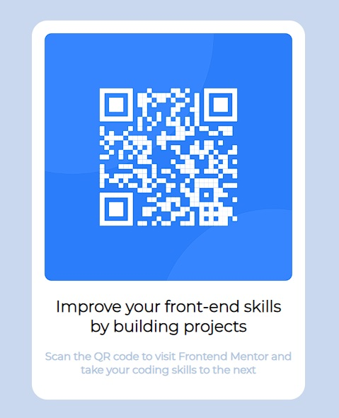

# Frontend Mentor - QR code component solution

This is a solution to the [QR code component challenge on Frontend Mentor](https://www.frontendmentor.io/challenges/qr-code-component-iux_sIO_H).

## Table of contents

- [Overview](#overview)
  - [Screenshot](#screenshot)
  - [Links](#links)
- [My process](#my-process)
  - [Built with](#built-with)
  - [What I learned](#what-i-learned)

## Overview

### Screenshot

### Links

- Live Site URL: [QR Code](https://alanjsan.github.io/qr-code-component-main/)

## My process

### Built with

- Semantic HTML5 markup
- CSS

### What I learned

I did this litle project to recap the basics before to continue learning new front-end technologies.

